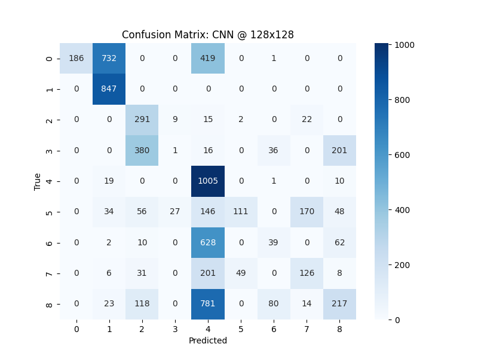

# Neural Cellular Automata for PathMNIST Classification

---
## Introduction
This repository contains a PyTorch implementation of Neural Cellular Automata (NCA) as described in https://distill.pub/2020/growing-ca/.
The NCA is trained to classify PathMNIST images and compared to a CNN baseline. Both models are tested on the higher scale
PathMNIST dataset with size 28x28, 64x64, 128x128, and 224x224 to evaluate the scalability of the NCA model.
---
## Getting Started

### Training
To train the NCA and CNN model run the jupyter notebooks (```train_cnn.ipynb``` and ```train_nca.ipynb```) in Google Colab.
### Evaluation
Before running the ```eval.ipynb``` notebook make sure to download the PathMIST datasets and upload them to your Google Drive, 
because the datasets are too big to load them in Google Colab directly.
### Visualization
Download the PathMNIST datasets into the directory ```data/``` and run 
```bash
python pygame_visualizer.py
```
Make sure the best models are in the ```models/``` directory.

---
## Results
The NCA model achieves better performance then the CNN baseline on the PathMNIST dataset 28, 64 and 128. In 224 both perform very bad, but the baseline perform slightly better.



